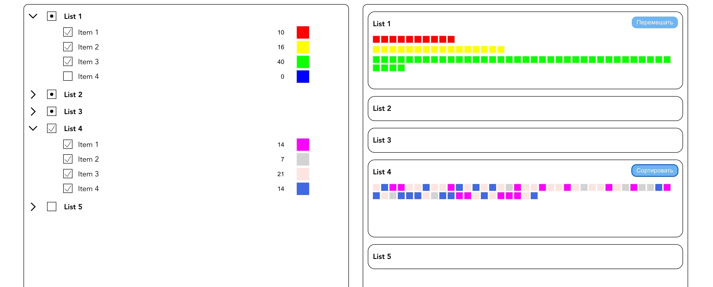

# Проект Lists (тестовое задание)

[Ссылка на проект на Vercel](https://lists-plum.vercel.app/#/)  

## Описание задания

Страница состоит из двух блоков:

1. Левая панель - список Lists с вложенными items. Каждый list и все его items представлены в виде чекбоксов.
   У каждого item есть параметры количество и цвет, доступные для изменения.  
2. Правая панель - список Lists в виде блоков. Все выбранные items из list левой панели отображаются в правой панели в
   виде цветных блоков - количество блоков и их цвет должны соответствовать выбранному item из левой панели. Каждый блок
   list имеет два состояния items - отсортированные и перемешанные в случайном порядке. Состояние меняется при нажатии
   на кнопку.

Входные данные: 5 элементов list с 4-10 вложенными items (произвольно). Каждый item имеет изначальные 'количество' и '
цвет' (произвольно).

## Требования

- при клике на чекбокс уровня List выбираются/снимаются все его items. Если у list есть хотя бы один выбранный item - в
  его чекбоксе отображается точка;
- сортировка и перемешивание цветных блоков отдельны для каждого list;
- lists в левой панели сворачиваются и разворачиваются;
- клик на цветовой блок в правой панели уменьшает параметр 'количество' соответствующего item;  
- все действия на странице происходят без ее перезагрузки;
- все изменяемые значения реактивны;
- задание выполнено на Vue.js;
- верстка выполнена без использования UI библиотек.  

### Стек:

* JS
* Vue, Vuex
* HTML
* CSS

## Директории

`/components` — папка с компонентами приложения  
`/router` - папка с роутингом приложения  
`/store` - папка с файлами глобального хранилища (стейта) приложения  
`/assets` - папка с изображениями и кастомными переиспользуемыми стилями

## Установка зависимостей и запуск проекта

##### `npm i` – установить зависимости

##### `npm serve` – запуск devServer на http://localhost:8080/

##### `npm build` – production сборка проекта

##### `npm lint` – запуск ESLint
